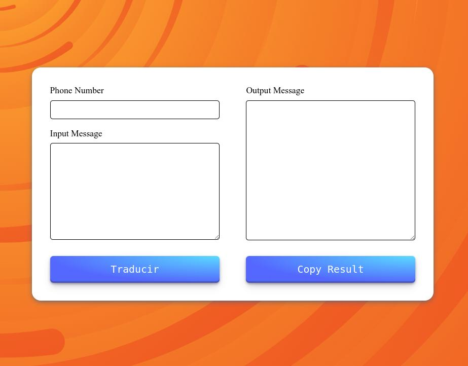

# String to whatsapp

See the tool [here](https://string-to-whatsapp.vercel.app/)

This tool allows you to quickly and easily generate URL-encoded messages using a number and a message. 

## Buiit with 
- [Astrojs](https://astro.build/)
- CSS
- Javascript

Thanks to [SVGBackgrounds.com](https://www.svgbackgrounds.com/set/free-svg-backgrounds-and-patterns/) for the background.

